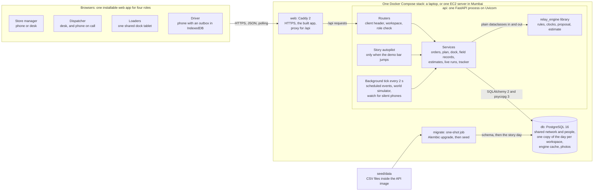
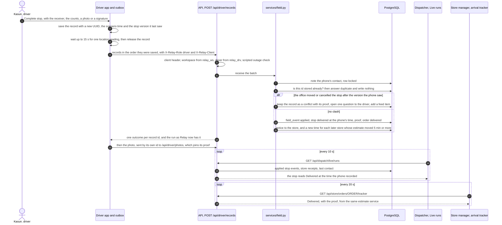

# Architecture

Relay is one installable web app for four roles, one API, one planning engine and one PostgreSQL database.
`docker compose up` starts all of it with the story day seeded, and the public demo at https://relay-ryzera.tech
runs the same stack on one server. This page describes the build as it is in the repository today. Every section
names the files that make it true.

## The system at a glance

Read it left to right. Every role uses the same web app in a browser. Caddy serves the built app and passes
`/api` requests to the API. The API checks who is asking and which copy of the day they work in, runs the service
for the request against PostgreSQL, and calls the planning engine in process when it needs a plan, a rule check or
an estimate. A background task in the same process moves every active copy of the day along its scenario clock.
There is no message broker, no cache server and no socket hub: one database is the only shared state.

## The parts

### apps/web: one PWA, one chunk per role

React 19, TypeScript, Vite 8, TanStack Query 5, React Router, Tailwind CSS 4, i18next and Dexie over IndexedDB.

- **Routes and chunks.** `/dispatcher`, `/loader`, `/driver` and `/store` each load their screens as a lazy chunk
  (`src/app/router.tsx`). In the current build the shared shell is about 163 KB gzipped and the role chunks are
  51 KB (dispatcher), 54 KB (driver), 16 KB (loader) and 15 KB (store), so a phone draws the driver's run after the
  shell and the driver chunk only.
- **Installable and offline.** `vite-plugin-pwa` generates a Workbox service worker that precaches the whole build
  (every role's chunk, the icons and the Sinhala, Tamil and Latin fonts), so the app opens with no signal. Only the
  driver's sign-in is kept on the device (`src/app/session.tsx`), because only the driver works without a connection.
- **One API client.** `src/api/client.ts` adds `X-Relay-Role` (the role the screen acts as) and `X-Relay-Client` to
  every request. Screens read one view model per GET and refresh it by polling (see the decision below).
- **The driver's phone.** `src/offline/outbox.ts` (the outbox), `src/offline/phone.ts` (the last run, proof drafts
  and the device id) and `src/roles/driver/sync.tsx` (sending, the minute check-in, the offline state).
- **Languages.** The driver and loader screens are in English, Sinhala and Tamil (`src/i18n/`). Each person's choice
  is stored per copy of the day on the server and comes back on any device. Store and dispatcher screens are English.

### apps/api: FastAPI over SQLAlchemy

FastAPI, SQLAlchemy 2, Alembic, Pydantic 2, psycopg 3, Argon2 and PyJWT on Python 3.12.

| Path | Holds |
|---|---|
| `routers/` | 57 HTTP routes under `/api` in ten routers (auth, demo, store, dispatch, plan, live, runs, dock, driver, photos), plus `/api/health`; OpenAPI at `/api/docs` |
| `services/` | The domain, one module per concern: `ordering`, `planning`, `board`, `drawer`, `changes`, `dock`, `driver`, `field`, `backup`, `estimates`, `runs`, `live`, `tracker`, `notify`, `outlook`, `world`, `story`, `simulator`, `watch`, `engine_cache`, `network`, `words` |
| `models/`, `schemas/` | 43 tables (see [data-model.md](data-model.md)) and the Pydantic response models |
| `workspaces.py`, `db.py` | Which copy of the day a request works in, and the ORM hook that scopes every query to it |
| `security.py` | Password and PIN hashes, per-role session cookies, role checks, the client header |
| `clock.py` | The scenario clock and the sixteen story moments the demo bar jumps to |
| `seed/` | Loads the network and the people once, then the story day into each copy |

A request to a role's route passes the same steps every time: the global `require_client_header` dependency,
`get_scope` (finds the workspace from the `relay_ws` cookie, falls back to the shared MAIN copy, scopes the session to
it), then `require(Role.X)` (reads that role's cookie), then a service call and one commit. Routers translate HTTP to
service calls and look up the rows a route names. The exceptions run their own queries: the order queue in
`routers/dispatch.py`, the store's home view, notices and notice acknowledgement in `routers/store.py`, and the demo
account list in `routers/auth.py`.

`relay-api setup` applies the seven Alembic migrations and seeds whatever is missing; Compose runs it as the
one-shot `migrate` service before `api` starts. `relay-api serve` runs one Uvicorn worker, whose lifespan starts the
background tick (`main.py`).

### packages/engine: the planning engine as a pure library

`relay_engine` depends on NumPy and SciPy and nothing else: no database, no web framework, no clock.

| Module | Does |
|---|---|
| `network.py` | The plain types: districts, outlets, vehicles, brands, temperatures, dock types |
| `model.py` | The plain data the engine plans with and returns: orders, each vehicle's day and usual trips, trips, rule results and reports, deferrals and the plan |
| `standard.py` | The organizers' published trip-time standard (booklet pages 20 and 21) and the 270 and 480 minute budgets |
| `clock.py` | Two clocks per trip: Planned (the standard at free flow) and Expected (traffic by hour, road index by date, each store's usual unloading) |
| `rules.py` | The eleven rules every trip is checked against, with plain-word reasons |
| `options.py` | Every trip one vehicle could run in one district that fits the limits and the windows |
| `solver.py` | The exact search: a mixed integer program over (vehicle, trip 1 or 2, option), solved with `scipy.optimize.milp` |
| `propose.py` | The proposal: chilled orders planned exactly, the most orders first, then Relay's three rules; ambient orders from each vehicle's usual run first. Explains each deferral as unavoidable or Relay's choice |
| `estimate.py` | The one estimate rule, its likely range and where the vehicle probably is |
| `reference.py` | Builds a `Network` straight from the organizers' CSV files, for tests and scripts |

The API adapts rows to these types in `services/network.py`.

### PostgreSQL 16

One database holds everything, in the `pgdata` volume. Twenty tables are shared: the network from the organizers'
reference data and what was derived from the route history, the people, the workspaces and the engine cache.
Twenty-three tables belong to one copy of the day each and carry a `workspace_id`. Enums are stored as text, so a new
value needs no migration; summaries, record payloads and workspace state are JSONB. Proof and damage photos are
stored in the `photo` table as bytes, so one `pg_dump` backs up the whole demo. The database publishes no port.

### Caddy

The `web` image is Caddy 2 with the built app in `/srv` (`apps/web/Dockerfile`, `apps/web/Caddyfile`). It serves the
app with a fallback to `index.html`, lets browsers cache the hashed `/assets` for a year and makes them check the
service worker files on every load, proxies `/api` to `api:8000`, compresses with zstd or gzip, and sets
`X-Content-Type-Options`, `Referrer-Policy` and a `Permissions-Policy` that allows location and camera for the app
itself only. Locally it answers on `:80`, published as port 8080. In production `SITE_ADDRESS` names the domain and
Caddy obtains and renews the HTTPS certificate on its own, which the installable app, the camera and location need.

### The world simulator and the story autopilot

A copy of the day has more people in it than the four judge accounts. Four things move it along the scenario clock,
all through the same services a person's device uses, all idempotent, all applied in time order by
`services/simulator.py:catch_up`:

- **Scheduled events** (`scheduled_event` rows): the stores that order later in the afternoon, and, inside the story's
  outage, what Kasun's phone saved with no signal, released in order when the signal returns.
- **The world simulator** (`services/world.py`): every loader, driver and store nobody is playing. `advance(db, now)`
  is a function of scenario time: loaders work through loads at four cases a minute, drivers accept, leave, arrive
  and deliver at the Expected clock from when the truck really left, send each record as a phone does, check in each
  minute and finish at the hub. A load a person has started is theirs to finish, and the judge characters' own
  trips are left to the judge.
- **The story autopilot** (`services/story.py`): the steps Dilani, Nuwan, Rizwan and Kasun take in the story, from
  Dilani's orders to Kasun finishing the trip at 7:17 AM. A step is played only when the demo bar jumps past it; a step
  the judge already took, or one that no longer fits what the judge did, is left alone. When time simply runs, the
  characters wait for the judge.
- **Watch** (`services/watch.py`): what Relay notices by itself. A running trip's phone silent for 5 minutes puts a
  silence item on the dispatcher's feed; a question to a driver unanswered for 10 minutes goes to the dispatcher.

The background tick calls `catch_up` every 2 seconds for each copy used in the last 6 hours. `catch_up` locks the
workspace row; the tick skips a copy that is locked, and a demo jump waits for it, so no step is applied twice.

## One delivery record, from the driver's outbox to the desk and the store

What the diagram does not show:

- **With no signal**, steps 4 to 13 wait. The record stays in IndexedDB with the time it was made, and the sender
  tries again when the browser says it is online, when the app comes to the front, after each new record and with the
  minute check-in. Records go before photos, so the stop reaches the office first on a weak signal. A delivery saved
  at 6:36 AM and sent at 7:14 AM reads 6:36 AM everywhere.
- **The clash branch** is the one question of the degradation story. The first answer wins: the driver's yes, or the
  dispatcher cancelling the backup's copy. A no, or 10 minutes with no answer, leaves it to the dispatcher.
- **Each record runs in its own savepoint.** A record Relay refuses (not this driver's vehicle, a stop on another
  trip, a time in the future) is kept with its reason for the audit and answered `rejected`; the rest of the batch
  still applies.
- **The dispatcher's row and the store's tracker** both read `services/estimates.py:run_estimate`, so they cannot
  disagree about a stop. A store's confirmed receipt counts as the delivery for every estimate after it, even before
  the driver's proof arrives.

## Decisions that shape the build

Each decision says what we chose, why, and what it costs.

### 1. The engine is a library

The plan has to be checked against eleven rules on every read, its deferrals explained, and the same logic reused
on the Datathon's CSV files. So `relay_engine` takes plain dataclasses in and returns plain dataclasses out, with no
database or web code, and the API adapts its rows to it in one module. The engine's tests need no database and run
on the seed's CSV files; the plan board re-checks stored trips with the same `rules.evaluate` the proposal uses. The
cost is one adapter layer (`services/network.py`) to keep in step with the models.

### 2. A scenario clock per copy

The story runs from Tuesday 7 April 2026, 2:05 PM, to Wednesday morning, and judges review it months later, often
skipping ahead. Each workspace carries `clock_anchor_real`, `clock_anchor_sim` and `clock_rate`, and scenario time is
the anchor plus the real time since, times the rate (`clock.py`). Everything Relay records about the day is stamped in
scenario time, and the driver's phone stamps its records with the scenario time Relay last told it, run forward. The
demo bar jumps to one of sixteen story moments or moves the clock 15 minutes or an hour ahead (the API can also pause
and resume it); the clock never moves back, and Reset starts the copy again. The cost: every "now" in the code must
come from the copy (`Scope.now`), never from the system clock.

### 3. Judge copies by workspace scoping in the ORM

Several judges may use the public URL at once, and one judge must be able to start again. Every operational table
mixes in `WorkspaceScoped`. `get_scope` puts the request's workspace id on the session, and one `do_orm_execute`
hook in `db.py` adds `workspace_id = :id` to every ORM select, update and delete on those tables, while a
`before_flush` hook stamps it on new rows. A forgotten filter cannot leak another copy:
`test_a_copy_cannot_reach_another_copys_loads` asks for a load from a second copy and gets 404. A private copy is the
story day seeded into a new workspace with a six-character code that a phone can join; Reset deletes the copy's rows
and seeds it again under a new edition id, so a phone lets go of what it kept from the earlier start. The escape hatch
`execution_options(all_workspaces=True)` is used for one purpose only: to refuse a record or photo id that already
exists in another copy. The cost is that raw SQL would bypass the hook, so services use the ORM throughout.

### 4. The world simulator

A judge plays one role at a time, but the dispatcher's queue should fill before the cutoff and Live runs should show
a real morning. `world.advance` makes everyone nobody is playing act on schedule, writing through the same services
and the same record path as a phone, so what the desk shows is produced the way real data would be. It brings the
copy to where it should be at a given scenario time, never backwards, and can run any number of times, which lets
the 2 second tick and a demo jump both call it. The story autopilot is kept apart and plays only the judge
characters' skipped steps, so a judge who does a step by hand is never overruled. The cost is a second actor writing
to every copy, which is why `catch_up` locks the workspace row.

### 5. Stop events, not GPS

Drivers use their own phones, a web app cannot track in the background, background tracking drains the battery and
follows people outside work, phones lose signal in the hills, and the data has no coordinates for outlets. The design
therefore promised drivers no tracking between stops. Progress is built from the driver's own records (load
accepted, departed, arrived, delivered, failed, a problem, trip finished), each with the time it happened. At
Arrived, Complete stop and Send report the phone tries one location reading for up to 15 seconds; the time is saved
at once and never waits. Relay stores the reading with the record (`field_event.lat`, `lng`, `accuracy_m`) but shows
no map and no distance, because there is no outlet position to compare it with. A check-in each minute, with no
location, tells the office the phone is reachable. A silent phone is shown as silent with an estimate, never as a
moving dot.

### 6. An offline outbox with idempotent ids and base versions

Kasun's phone loses signal for 93 minutes in the story and keeps working. Every driver action is written to IndexedDB
first, with a UUID made on the phone, the scenario time and the stop version the phone last saw. The sender posts
records in saved order, then photos, one flush at a time. On the server the phone's UUID is the primary key of
`field_event`, so a resend is answered `duplicate` and writes nothing; photos are idempotent by their own id; the
store's order, receipt and later issue reports carry a `client_ref` for the same reason; dock writes set a count
rather than add to it, and a second flag on a flagged line is refused. The base version detects an office change made
while the phone was silent: only a move to a backup or a cancellation clashes, never a time change or a note. The
phone may send a record many times; Relay applies it once.

### 7. One estimate rule

The dispatcher, the store and the driver all see when a store can expect its delivery, and they must never disagree.
The rule lives in `relay_engine/estimate.py` and is fed from one place, `services/estimates.py`, which Live runs and
the store's tracker read directly; the driver's phone shows the time each store was last told, which comes from the
same function. Start from the last stop event Relay has (an arrival, a delivery, or a store's confirmed receipt;
before the first stop, the departure), add that store's usual unloading time if it was an arrival, then drive each
leg on the Expected clock and add each store's usual unloading. Round to 5 minutes. The estimate moves only when a
stop event arrives; time passing never pushes it later, and a delay report goes to the dispatcher's feed without
moving it. While the phone has been silent for 5 minutes on a running trip, the store and the dispatcher also see a
likely range: 15 minutes either side plus half of every silent minute, rounded outwards to 5 minutes, never starting
before now. Stores still to come are told a new time when their estimate moves by 5 minutes or more.

### 8. The engine cache

A proposal takes about 23 to 31 seconds (see Performance), and every new private copy asks the same first question. The
engine is deterministic, so `services/engine_cache.py` stores each answer in the shared `engine_cache` table under a
SHA-256 of everything the engine reads (the network, orders, vehicles, usual runs, conditions and protected stores)
together with a hash of the engine's own source files. Change any input, or the engine, and the key changes; an
insert that races another is dropped with `ON CONFLICT DO NOTHING`. The answer is written into the copy's own trips
and stops, so each dispatcher edits their own plan. The cost is a table that grows by a few kilobytes per distinct
input, with no eviction yet.

### 9. Per-role session cookies

A judge keeps several roles open side by side in one browser. Each role has its own httpOnly cookie (`relay_dsp`,
`relay_ldr`, `relay_drv`, `relay_stm`), each a 12-hour HS256 token, and every request names the role it acts as in
`X-Relay-Role` (photos, loaded by image tags that cannot send headers, use `?as=` instead). The API reads only that
role's cookie and checks the token's user still has that role, so signing in as Dilani in one tab leaves Nuwan
signed in in the next. The cost is that one browser can hold four identities at once, which suits a demo and would be
narrowed to one in a real deployment.

### 10. Terraform and one Compose stack

Judges run `docker compose up`, and the public URL must behave the same way. The server runs the same
`docker-compose.yml` with one small overlay, `docker-compose.prod.yml`, that opens 80 and 443 and keeps Caddy's
certificates in volumes. `infra/terraform` describes the one server: an Ubuntu 24.04 `m7i-flex.large` in `ap-south-1`,
a 30 GB encrypted disk, IMDSv2 only, an Elastic IP, and a security group with 80 and 443 open and SSH only from the
team's addresses. `infra/deploy.sh` ships the committed `HEAD` with `git archive`, so uncommitted work is never
deployed, and `infra/server/up.sh` rebuilds and installs a nightly `pg_dump` that keeps 14 days. CI builds the same
images. The cost is one machine: no failover, and scaling out needs the steps listed at the end.

### 11. Polling, not server-sent events

The build plan proposed server-sent events for live updates. We poll instead, with TanStack Query: the dock every 8 to
10 seconds, the order queue and Live runs every 10, the plan board 15, the store 20, the capacity outlook 30, the
driver's run 30 plus the minute check-in, and every screen again when it comes to the front. Each screen already reads
one complete view model per GET, polling survives the dropped connections of phones on the road, and nothing in Caddy
or the API has to hold a stream open. The cost is that a change reaches another screen up to one interval late.

## Security model

- **Sign-in.** Usernames with a password, or for the dock tablet a username with a 4-digit PIN; drivers also have a PIN
  so they can accept a load on the tablet while the tablet stays signed in as the loader. Passwords and PINs are stored
  as Argon2id hashes (`security.py`). A wrong password or PIN gets one plain message that does not say which part was
  wrong.
- **Sessions.** One httpOnly, `SameSite=Lax` cookie per role holding a signed HS256 token that expires after 12 hours;
  `Secure` in production (`RELAY_COOKIE_SECURE=true`). The token names the user and the role, and the API reloads the
  user on every request.
- **Cross-site requests.** Every POST, PUT, PATCH and DELETE must carry `X-Relay-Client`, a custom header that a
  cross-site form or image cannot send; the dependency is global (`main.py`).
- **Role checks on every route.** Each role's routers take `require(Role.X)` on every endpoint. A store manager reaches
  only orders of the store linked to the account, a driver only trips of the vehicle assigned for the day, and a photo
  is served only to the driver who took it, the store it was taken at, the dispatcher, or the dock for damage photos.
  The open routes are sign-in and sign-out, `/api/health`, the API docs, the demo routes and the list of demo
  accounts.
- **Workspace isolation.** Enforced in the ORM for every scoped table (decision 3), with record and photo ids refused
  across copies.
- **Idempotency.** Phone records and photos by their own UUID, store orders, receipts and issues by `client_ref`
  (decision 6).
- **Input and upload limits.** Pydantic bounds the request fields: at most 200 records per batch, 12 lines per order
  with at most 999 cases a line, dock and receipt counts within 9,999, typed notes and reasons capped at 120 to 500
  characters. A driver record's payload is free JSON: `field_event` keeps it as sent, and the field service cuts the
  text it copies into the proof, the stop and the reports (receiver 64, reason 200, note 500, signature 20,000
  characters). A photo may be JPEG, WebP or PNG by its declared type and at most 1.5 MB; the API reads one byte past
  the limit and refuses anything longer. Phones and the tablet shrink photos to 1280 px JPEG before sending.
- **Secrets.** `.env` and Terraform state are ignored by git. On the server `up.sh` writes `/opt/relay/.env` once with
  a random database password and session key (`openssl rand`, file mode 600). Only Caddy publishes ports; the
  database and the API are reachable only inside the Compose network.
- **Demo mode, by design.** With `RELAY_DEMO_MODE=true` (the default, and on the public demo) the accounts and their
  shared password are listed on the sign-in page, and anyone who can reach the URL can move the clock, start a
  private copy, or reset the copy they are in, including the shared MAIN copy. That is why the walkthrough sends
  judges to a private copy. With demo mode off, every demo route that changes something answers 404 and the account
  list is empty.
- **Known gaps.** No rate limit or lockout on sign-in, no Content-Security-Policy or HSTS header, no request body limit
  in Caddy, and the photo type is taken from the declared content type. All four are on the list below.

## Testing

| Suite | Tests | What it proves | How it runs |
|---|---|---|---|
| Engine, `packages/engine/tests` | 27 in 5 files | The trip-time standard reproduces the booklet's worked examples. The Planned and Expected clocks for Kasun's run. The story-day proposal for the Kandy hub: 18 trips carry 56 of 57 orders, one chilled order waits and rule two picks which. Every proposed trip keeps all eleven rules, and no workshop or standby vehicle is used. The estimate, its widening range, and a receipt counting as the delivery | `uv run pytest packages/engine/tests`, no database |
| API, `apps/api/tests` | 53 in 8 files | Against a real PostgreSQL: each run creates a throwaway database, migrates and seeds it like a fresh install, and drives new private copies over HTTP the way the web app does. Kasun's morning at each demo moment as the autopilot and the world play it; resends answered as duplicates; signal lost, backup sent and the clash settled with one question; nothing reaching Relay inside the storm; the dock night from flag to handover; a copy unable to reach another copy's loads; changes after publishing; the capacity outlook and Peliyagoda's empty state; a language choice staying in its copy | `uv run pytest apps/api/tests` with `RELAY_TEST_ADMIN_URL` naming a PostgreSQL server |
| Web, `apps/web/src/**/*.test.ts(x)` | 92 in 18 files | With Vitest, jsdom and fake-indexeddb: the outbox keeps order, sends records before photos, holds a record for its location, keeps Relay's reason for a refusal and never sends a record twice at once. The phone's own records over Relay's run; the sync pill's counts; the dock tablet's taps reaching the screen in the order they were made; the store's receipt keeping its `client_ref` offline; the live desk's words for a silent run; dates and times in three languages | `pnpm --filter @relay/web test` |

All 172 pass. The API suite is the slow one, about 8 minutes on a development laptop and 6 in CI, because most of
its tests jump a new copy through the night.

CI (`.github/workflows/ci.yml`) runs on every push to `main` and every pull request, in three jobs: Ruff lint and
format check plus `pytest` against a PostgreSQL 16 service; Biome lint, Vitest, and the TypeScript check with the
production build; and `docker compose build` of every image. Not covered yet: there is no browser end-to-end test
(`e2e/` holds only its `package.json`), and `mypy --strict` is configured in `pyproject.toml` but not run in CI.

## Performance

- **The proposal.** Measured on the story day with the engine alone, on a development laptop: the Kandy hub
  (57 orders, 18 trips, one order waits) takes about 23 seconds, Peliyagoda (79 orders, 26 trips, nothing waits)
  27 to 31. Most of it is SciPy's MILP solver. Kandy runs 44 solves: 2 for the chilled allocation, 38 to explain the
  waiting order by solving again without each of the 23 chilled orders in turn (about 9 seconds together), and 4 for
  the ambient orders. The slowest single step in both depots is the search that places leftover ambient orders on free
  trip slots: about 9 seconds at Kandy and 22 at Peliyagoda. Each solve is capped at 30 seconds, each explanation
  solve at 10.
- **The cache.** On a hit, computing the key takes about 10 ms and the lookup about 2 ms; a stored answer is 2 to
  3 KB. Only the first copy to ask a question waits for the solver. Because the cache lives in the database, it
  survives restarts and redeploys.
- **The network.** Districts, outlets, vehicles and allowances are read from the database once per process and kept
  in memory (`services/network.py`); they never change while Relay runs.
- **The clock.** One jump from Tuesday 2:05 PM to Wednesday 7:22 AM in a new copy, with the cache warm, plays every
  story step and the whole world on the way; in the API suite that test (`test_settled`) takes about 30 seconds,
  sign-ins and reads included. The 2 second tick does the same work in small steps and skips a copy that is busy.
- **Requests.** Proposals run in FastAPI's thread pool, so other requests go on while one solves. Each open screen
  sends one GET per polling interval and reads its whole view model in it.
- **The phone.** Photos are shrunk on the device before they are queued; the driver's first load is the shell plus
  the driver chunk, about 217 KB gzipped together.

## What we would do next

1. Push live changes over server-sent events, keeping polling as the fallback for phones, and add Background Sync on
   Android so the outbox also sends while the app is closed.
2. Generate the web app's types from the OpenAPI schema; today they are written by hand, and 11 JSON routes return
   plain dictionaries without a response model.
3. Run the numbered judge walkthrough as a Playwright test in CI, and add `mypy --strict` to the Python job.
4. Close the security gaps: rate limits and lockout on sign-in and PINs, a request body limit in Caddy, CSP and HSTS
   headers, checking photo bytes instead of the declared type, and refusing to start with the default session key
   outside demo mode.
5. Precache each role's chunk only on the devices that use it, and load each role's strings with its own chunk.
6. Move photos to object storage, and evict old engine cache rows.
7. With outlet coordinates, compare a record's location reading with the store and show the distance; let a delay
   report move the estimate.
8. To run more than one server: a second API worker is already safe (the workspace lock serialises the tick), and the
   next steps are a managed PostgreSQL, the tick in its own process, and Caddy in front of several API containers.
