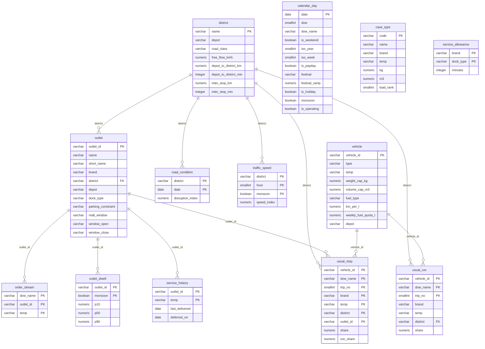
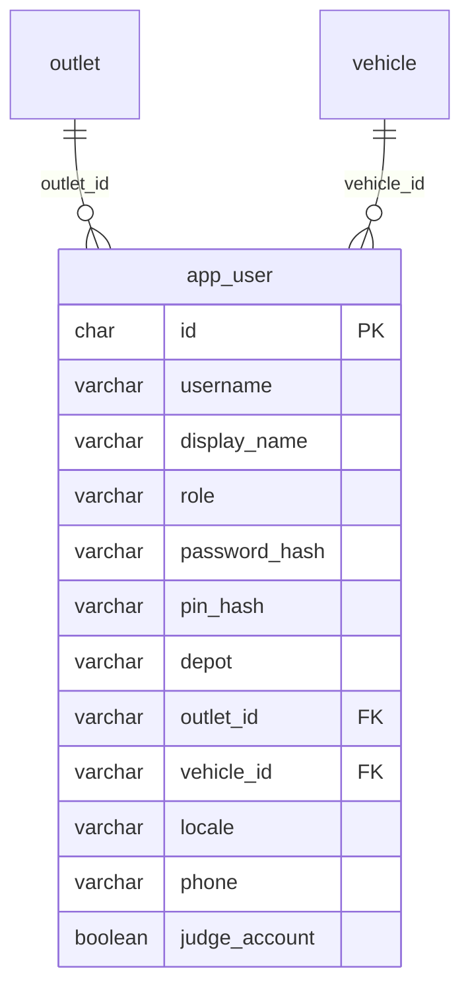
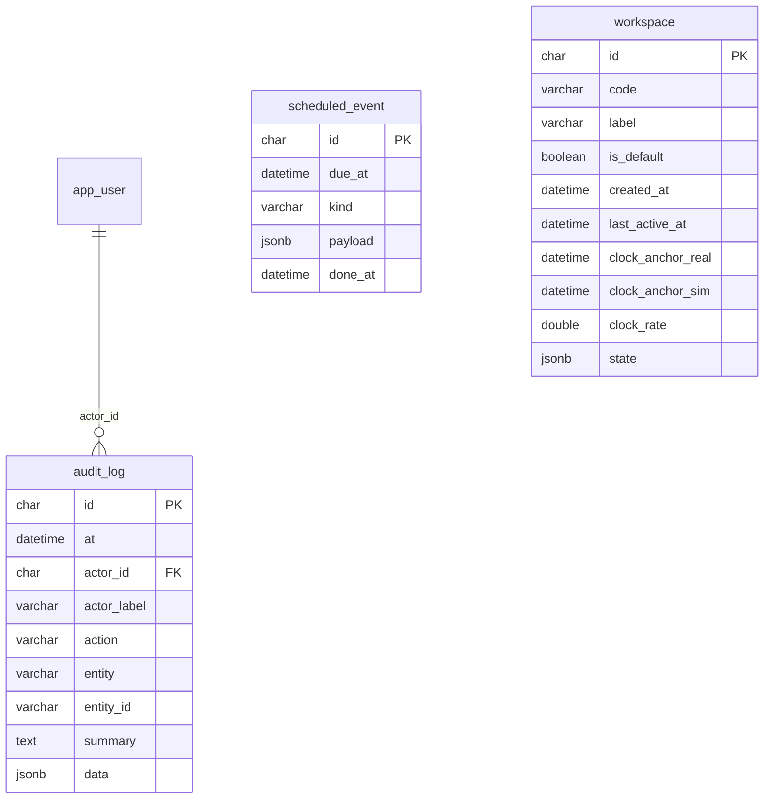
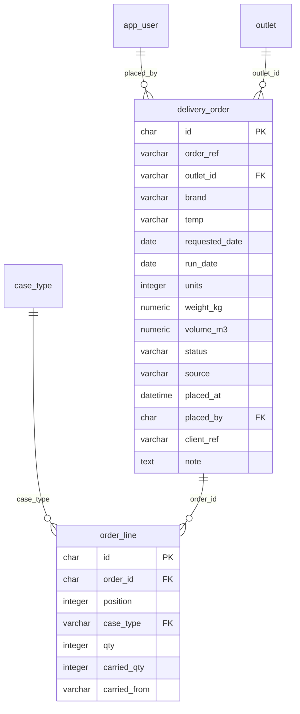
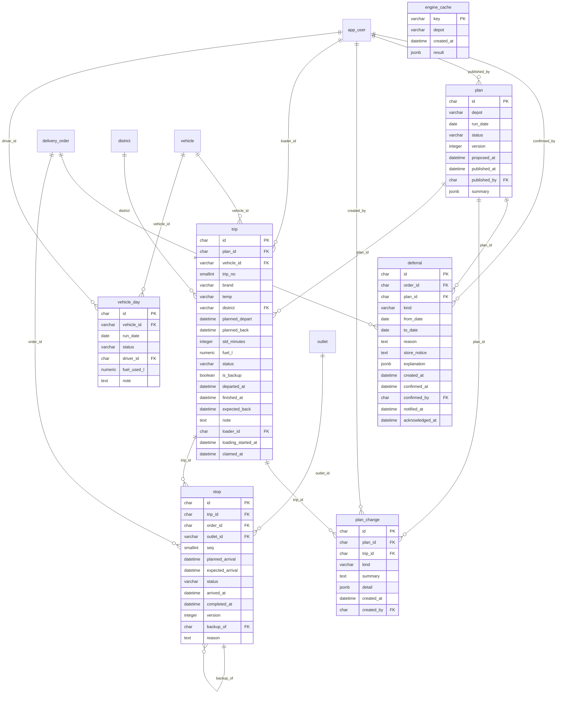
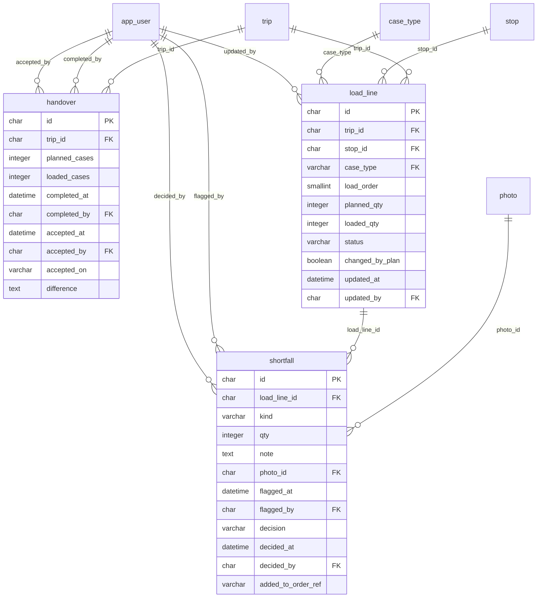
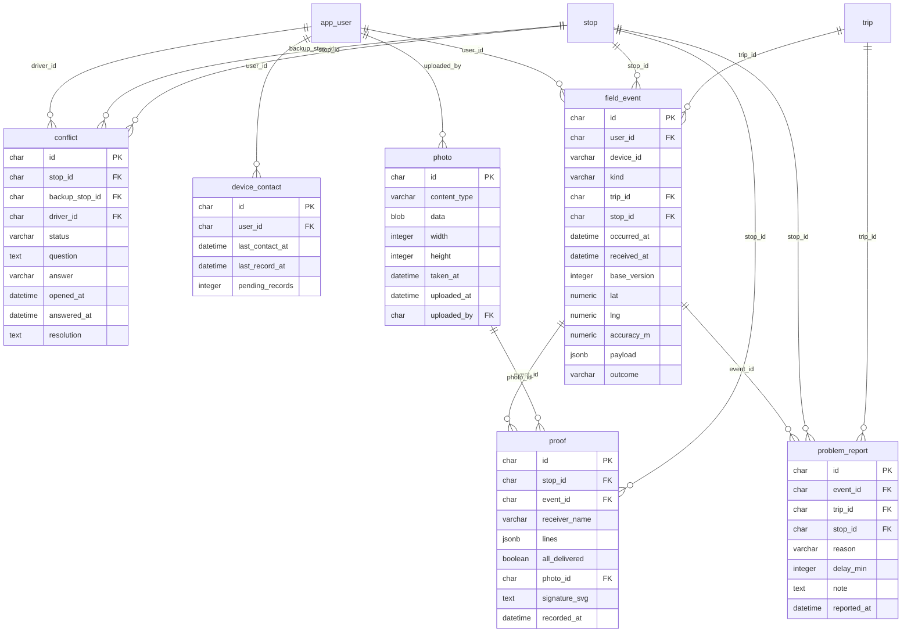
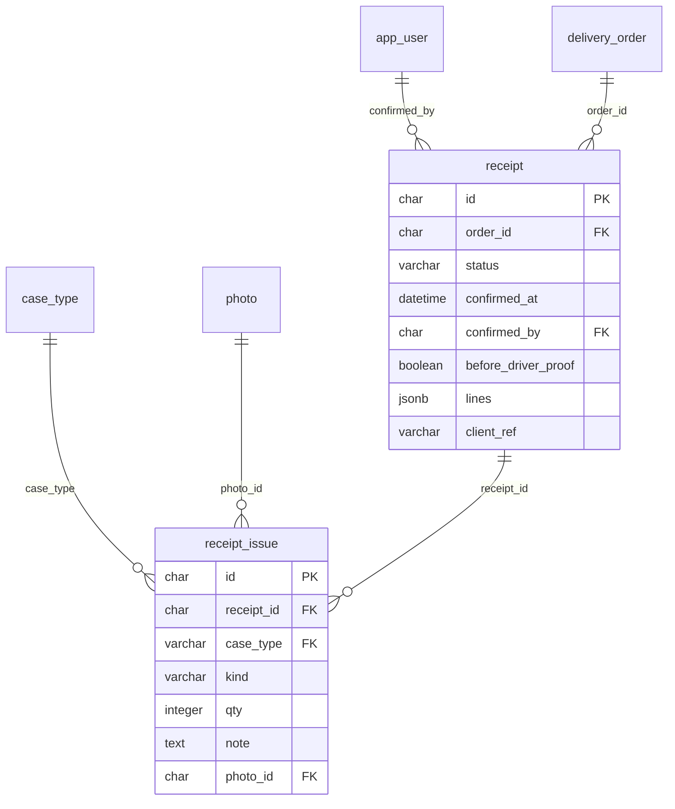
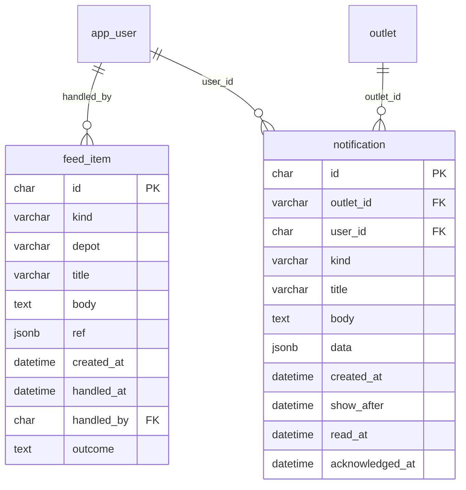

# Data model

Generated from the SQLAlchemy models by `tools/data_model.py`; do not edit by hand.

Every table marked **per copy** belongs to one copy of the delivery day (a workspace) and carries a
`workspace_id`. One ORM hook in `relay_api/db.py` adds `workspace_id = :id` to every query on those
tables, so no endpoint can read another copy by forgetting a filter. Reference tables, people and the
engine cache are shared by every copy.

## The network: the organizers' reference tables and what Relay learned from the route history

### `calendar_day`

Base class used for declarative class definitions. The :class:`_orm.DeclarativeBase` allows for the creation of new declarative bases in such a way that is compatible with type checkers:: from sqlalchemy.orm import DeclarativeBase class Base(DeclarativeBase): pass The above ``Base`` class is now usable as the base for new declarative mappings. The superclass makes use of the ``__init_subclass__()`` method to set up new classes and metaclasses aren't used. When first used, the :class:`_orm.DeclarativeBase` class instantiates a new :class:`_orm.registry` to be used with the base, assuming one was not provided explicitly. The :class:`_orm.DeclarativeBase` class supports class-level attributes which act as parameters for the construction of this registry; such as to indicate a specific :class:`_schema.MetaData` collection as well as a specific value for :paramref:`_orm.registry.type_annotation_map`:: from typing import Annotated from sqlalchemy import BigInteger from sqlalchemy import MetaData from sqlalchemy import String from sqlalchemy.orm import DeclarativeBase bigint = Annotated[int, "bigint"] my_metadata = MetaData() class Base(DeclarativeBase): metadata = my_metadata type_annotation_map = { str: String().with_variant(String(255), "mysql", "mariadb"), bigint: BigInteger(), } Class-level attributes which may be specified include: :param metadata: optional :class:`_schema.MetaData` collection. If a :class:`_orm.registry` is constructed automatically, this :class:`_schema.MetaData` collection will be used to construct it. Otherwise, the local :class:`_schema.MetaData` collection will supersede that used by an existing :class:`_orm.registry` passed using the :paramref:`_orm.DeclarativeBase.registry` parameter. :param type_annotation_map: optional type annotation map that will be passed to the :class:`_orm.registry` as :paramref:`_orm.registry.type_annotation_map`. :param registry: supply a pre-existing :class:`_orm.registry` directly. .. versionadded:: 2.0 Added :class:`.DeclarativeBase`, so that declarative base classes may be constructed in such a way that is also recognized by :pep:`484` type checkers. As a result, :class:`.DeclarativeBase` and other subclassing-oriented APIs should be seen as superseding previous "class returned by a function" APIs, namely :func:`_orm.declarative_base` and :meth:`_orm.registry.generate_base`, where the base class returned cannot be recognized by type checkers without using plugins. **__init__ behavior** In a plain Python class, the base-most ``__init__()`` method in the class hierarchy is ``object.__init__()``, which accepts no arguments. However, when the :class:`_orm.DeclarativeBase` subclass is first declared, the class is given an ``__init__()`` method that links to the :paramref:`_orm.registry.constructor` constructor function, if no ``__init__()`` method is already present; this is the usual declarative constructor that will assign keyword arguments as attributes on the instance, assuming those attributes are established at the class level (i.e. are mapped, or are linked to a descriptor). This constructor is **never accessed by a mapped class without being called explicitly via super()**, as mapped classes are themselves given an ``__init__()`` method directly which calls :paramref:`_orm.registry.constructor`, so in the default case works independently of what the base-most ``__init__()`` method does. .. versionchanged:: 2.0.1 :class:`_orm.DeclarativeBase` has a default constructor that links to :paramref:`_orm.registry.constructor` by default, so that calls to ``super().__init__()`` can access this constructor. Previously, due to an implementation mistake, this default constructor was missing, and calling ``super().__init__()`` would invoke ``object.__init__()``. The :class:`_orm.DeclarativeBase` subclass may also declare an explicit ``__init__()`` method which will replace the use of the :paramref:`_orm.registry.constructor` function at this level:: class Base(DeclarativeBase): def __init__(self, id=None): self.id = id Mapped classes still will not invoke this constructor implicitly; it remains only accessible by calling ``super().__init__()``:: class MyClass(Base): def __init__(self, id=None, name=None): self.name = name super().__init__(id=id) Note that this is a different behavior from what functions like the legacy :func:`_orm.declarative_base` would do; the base created by those functions would always install :paramref:`_orm.registry.constructor` for ``__init__()``.

| Column | Type | Notes |
|---|---|---|
| `date` | date | primary key |
| `dow` | smallint |  |
| `dow_name` | varchar |  |
| `is_weekend` | boolean |  |
| `iso_year` | smallint |  |
| `iso_week` | smallint |  |
| `is_payday` | boolean |  |
| `festival` | varchar | optional |
| `festival_ramp` | numeric |  |
| `is_holiday` | boolean |  |
| `monsoon` | boolean |  |
| `is_operating` | boolean |  |

### `case_type`

Standard case types a store orders in, so the planner gets real weight and volume.

| Column | Type | Notes |
|---|---|---|
| `code` | varchar | primary key |
| `name` | varchar |  |
| `brand` | varchar |  |
| `temp` | varchar |  |
| `kg` | numeric |  |
| `m3` | numeric |  |
| `load_rank` | smallint | Heaviest first within a stop: lower loads first. |

### `district`

Base class used for declarative class definitions. The :class:`_orm.DeclarativeBase` allows for the creation of new declarative bases in such a way that is compatible with type checkers:: from sqlalchemy.orm import DeclarativeBase class Base(DeclarativeBase): pass The above ``Base`` class is now usable as the base for new declarative mappings. The superclass makes use of the ``__init_subclass__()`` method to set up new classes and metaclasses aren't used. When first used, the :class:`_orm.DeclarativeBase` class instantiates a new :class:`_orm.registry` to be used with the base, assuming one was not provided explicitly. The :class:`_orm.DeclarativeBase` class supports class-level attributes which act as parameters for the construction of this registry; such as to indicate a specific :class:`_schema.MetaData` collection as well as a specific value for :paramref:`_orm.registry.type_annotation_map`:: from typing import Annotated from sqlalchemy import BigInteger from sqlalchemy import MetaData from sqlalchemy import String from sqlalchemy.orm import DeclarativeBase bigint = Annotated[int, "bigint"] my_metadata = MetaData() class Base(DeclarativeBase): metadata = my_metadata type_annotation_map = { str: String().with_variant(String(255), "mysql", "mariadb"), bigint: BigInteger(), } Class-level attributes which may be specified include: :param metadata: optional :class:`_schema.MetaData` collection. If a :class:`_orm.registry` is constructed automatically, this :class:`_schema.MetaData` collection will be used to construct it. Otherwise, the local :class:`_schema.MetaData` collection will supersede that used by an existing :class:`_orm.registry` passed using the :paramref:`_orm.DeclarativeBase.registry` parameter. :param type_annotation_map: optional type annotation map that will be passed to the :class:`_orm.registry` as :paramref:`_orm.registry.type_annotation_map`. :param registry: supply a pre-existing :class:`_orm.registry` directly. .. versionadded:: 2.0 Added :class:`.DeclarativeBase`, so that declarative base classes may be constructed in such a way that is also recognized by :pep:`484` type checkers. As a result, :class:`.DeclarativeBase` and other subclassing-oriented APIs should be seen as superseding previous "class returned by a function" APIs, namely :func:`_orm.declarative_base` and :meth:`_orm.registry.generate_base`, where the base class returned cannot be recognized by type checkers without using plugins. **__init__ behavior** In a plain Python class, the base-most ``__init__()`` method in the class hierarchy is ``object.__init__()``, which accepts no arguments. However, when the :class:`_orm.DeclarativeBase` subclass is first declared, the class is given an ``__init__()`` method that links to the :paramref:`_orm.registry.constructor` constructor function, if no ``__init__()`` method is already present; this is the usual declarative constructor that will assign keyword arguments as attributes on the instance, assuming those attributes are established at the class level (i.e. are mapped, or are linked to a descriptor). This constructor is **never accessed by a mapped class without being called explicitly via super()**, as mapped classes are themselves given an ``__init__()`` method directly which calls :paramref:`_orm.registry.constructor`, so in the default case works independently of what the base-most ``__init__()`` method does. .. versionchanged:: 2.0.1 :class:`_orm.DeclarativeBase` has a default constructor that links to :paramref:`_orm.registry.constructor` by default, so that calls to ``super().__init__()`` can access this constructor. Previously, due to an implementation mistake, this default constructor was missing, and calling ``super().__init__()`` would invoke ``object.__init__()``. The :class:`_orm.DeclarativeBase` subclass may also declare an explicit ``__init__()`` method which will replace the use of the :paramref:`_orm.registry.constructor` function at this level:: class Base(DeclarativeBase): def __init__(self, id=None): self.id = id Mapped classes still will not invoke this constructor implicitly; it remains only accessible by calling ``super().__init__()``:: class MyClass(Base): def __init__(self, id=None, name=None): self.name = name super().__init__(id=id) Note that this is a different behavior from what functions like the legacy :func:`_orm.declarative_base` would do; the base created by those functions would always install :paramref:`_orm.registry.constructor` for ``__init__()``.

| Column | Type | Notes |
|---|---|---|
| `name` | varchar | primary key |
| `depot` | varchar |  |
| `road_class` | varchar |  |
| `free_flow_kmh` | numeric |  |
| `depot_to_district_km` | numeric |  |
| `depot_to_district_min` | integer |  |
| `inter_stop_km` | numeric |  |
| `inter_stop_min` | integer |  |

### `order_stream`

A store that orders on this weekday, with this temperature, in nearly every week of the history. The order queue uses it to list the stores that have not ordered yet.

| Column | Type | Notes |
|---|---|---|
| `dow_name` | varchar | primary key |
| `outlet_id` | varchar | primary key; → `outlet.outlet_id` |
| `temp` | varchar | primary key |

### `outlet`

Base class used for declarative class definitions. The :class:`_orm.DeclarativeBase` allows for the creation of new declarative bases in such a way that is compatible with type checkers:: from sqlalchemy.orm import DeclarativeBase class Base(DeclarativeBase): pass The above ``Base`` class is now usable as the base for new declarative mappings. The superclass makes use of the ``__init_subclass__()`` method to set up new classes and metaclasses aren't used. When first used, the :class:`_orm.DeclarativeBase` class instantiates a new :class:`_orm.registry` to be used with the base, assuming one was not provided explicitly. The :class:`_orm.DeclarativeBase` class supports class-level attributes which act as parameters for the construction of this registry; such as to indicate a specific :class:`_schema.MetaData` collection as well as a specific value for :paramref:`_orm.registry.type_annotation_map`:: from typing import Annotated from sqlalchemy import BigInteger from sqlalchemy import MetaData from sqlalchemy import String from sqlalchemy.orm import DeclarativeBase bigint = Annotated[int, "bigint"] my_metadata = MetaData() class Base(DeclarativeBase): metadata = my_metadata type_annotation_map = { str: String().with_variant(String(255), "mysql", "mariadb"), bigint: BigInteger(), } Class-level attributes which may be specified include: :param metadata: optional :class:`_schema.MetaData` collection. If a :class:`_orm.registry` is constructed automatically, this :class:`_schema.MetaData` collection will be used to construct it. Otherwise, the local :class:`_schema.MetaData` collection will supersede that used by an existing :class:`_orm.registry` passed using the :paramref:`_orm.DeclarativeBase.registry` parameter. :param type_annotation_map: optional type annotation map that will be passed to the :class:`_orm.registry` as :paramref:`_orm.registry.type_annotation_map`. :param registry: supply a pre-existing :class:`_orm.registry` directly. .. versionadded:: 2.0 Added :class:`.DeclarativeBase`, so that declarative base classes may be constructed in such a way that is also recognized by :pep:`484` type checkers. As a result, :class:`.DeclarativeBase` and other subclassing-oriented APIs should be seen as superseding previous "class returned by a function" APIs, namely :func:`_orm.declarative_base` and :meth:`_orm.registry.generate_base`, where the base class returned cannot be recognized by type checkers without using plugins. **__init__ behavior** In a plain Python class, the base-most ``__init__()`` method in the class hierarchy is ``object.__init__()``, which accepts no arguments. However, when the :class:`_orm.DeclarativeBase` subclass is first declared, the class is given an ``__init__()`` method that links to the :paramref:`_orm.registry.constructor` constructor function, if no ``__init__()`` method is already present; this is the usual declarative constructor that will assign keyword arguments as attributes on the instance, assuming those attributes are established at the class level (i.e. are mapped, or are linked to a descriptor). This constructor is **never accessed by a mapped class without being called explicitly via super()**, as mapped classes are themselves given an ``__init__()`` method directly which calls :paramref:`_orm.registry.constructor`, so in the default case works independently of what the base-most ``__init__()`` method does. .. versionchanged:: 2.0.1 :class:`_orm.DeclarativeBase` has a default constructor that links to :paramref:`_orm.registry.constructor` by default, so that calls to ``super().__init__()`` can access this constructor. Previously, due to an implementation mistake, this default constructor was missing, and calling ``super().__init__()`` would invoke ``object.__init__()``. The :class:`_orm.DeclarativeBase` subclass may also declare an explicit ``__init__()`` method which will replace the use of the :paramref:`_orm.registry.constructor` function at this level:: class Base(DeclarativeBase): def __init__(self, id=None): self.id = id Mapped classes still will not invoke this constructor implicitly; it remains only accessible by calling ``super().__init__()``:: class MyClass(Base): def __init__(self, id=None, name=None): self.name = name super().__init__(id=id) Note that this is a different behavior from what functions like the legacy :func:`_orm.declarative_base` would do; the base created by those functions would always install :paramref:`_orm.registry.constructor` for ``__init__()``.

| Column | Type | Notes |
|---|---|---|
| `outlet_id` | varchar | primary key |
| `name` | varchar |  |
| `short_name` | varchar |  |
| `brand` | varchar |  |
| `district` | varchar | → `district.name` |
| `depot` | varchar |  |
| `dock_type` | varchar |  |
| `parking_constraint` | varchar |  |
| `mall_window` | varchar | optional |
| `window_open` | varchar |  |
| `window_close` | varchar |  |

### `outlet_dwell`

Each store's usual unloading time in minutes, from the route history (Relay's Expected clock).

| Column | Type | Notes |
|---|---|---|
| `outlet_id` | varchar | primary key; → `outlet.outlet_id` |
| `monsoon` | boolean | primary key |
| `p10` | numeric |  |
| `p50` | numeric |  |
| `p90` | numeric |  |

### `road_condition`

Date-specific disruption by district; 100 is a clear road.

| Column | Type | Notes |
|---|---|---|
| `district` | varchar | primary key; → `district.name` |
| `date` | date | primary key |
| `disruption_index` | numeric |  |

### `service_allowance`

Base class used for declarative class definitions. The :class:`_orm.DeclarativeBase` allows for the creation of new declarative bases in such a way that is compatible with type checkers:: from sqlalchemy.orm import DeclarativeBase class Base(DeclarativeBase): pass The above ``Base`` class is now usable as the base for new declarative mappings. The superclass makes use of the ``__init_subclass__()`` method to set up new classes and metaclasses aren't used. When first used, the :class:`_orm.DeclarativeBase` class instantiates a new :class:`_orm.registry` to be used with the base, assuming one was not provided explicitly. The :class:`_orm.DeclarativeBase` class supports class-level attributes which act as parameters for the construction of this registry; such as to indicate a specific :class:`_schema.MetaData` collection as well as a specific value for :paramref:`_orm.registry.type_annotation_map`:: from typing import Annotated from sqlalchemy import BigInteger from sqlalchemy import MetaData from sqlalchemy import String from sqlalchemy.orm import DeclarativeBase bigint = Annotated[int, "bigint"] my_metadata = MetaData() class Base(DeclarativeBase): metadata = my_metadata type_annotation_map = { str: String().with_variant(String(255), "mysql", "mariadb"), bigint: BigInteger(), } Class-level attributes which may be specified include: :param metadata: optional :class:`_schema.MetaData` collection. If a :class:`_orm.registry` is constructed automatically, this :class:`_schema.MetaData` collection will be used to construct it. Otherwise, the local :class:`_schema.MetaData` collection will supersede that used by an existing :class:`_orm.registry` passed using the :paramref:`_orm.DeclarativeBase.registry` parameter. :param type_annotation_map: optional type annotation map that will be passed to the :class:`_orm.registry` as :paramref:`_orm.registry.type_annotation_map`. :param registry: supply a pre-existing :class:`_orm.registry` directly. .. versionadded:: 2.0 Added :class:`.DeclarativeBase`, so that declarative base classes may be constructed in such a way that is also recognized by :pep:`484` type checkers. As a result, :class:`.DeclarativeBase` and other subclassing-oriented APIs should be seen as superseding previous "class returned by a function" APIs, namely :func:`_orm.declarative_base` and :meth:`_orm.registry.generate_base`, where the base class returned cannot be recognized by type checkers without using plugins. **__init__ behavior** In a plain Python class, the base-most ``__init__()`` method in the class hierarchy is ``object.__init__()``, which accepts no arguments. However, when the :class:`_orm.DeclarativeBase` subclass is first declared, the class is given an ``__init__()`` method that links to the :paramref:`_orm.registry.constructor` constructor function, if no ``__init__()`` method is already present; this is the usual declarative constructor that will assign keyword arguments as attributes on the instance, assuming those attributes are established at the class level (i.e. are mapped, or are linked to a descriptor). This constructor is **never accessed by a mapped class without being called explicitly via super()**, as mapped classes are themselves given an ``__init__()`` method directly which calls :paramref:`_orm.registry.constructor`, so in the default case works independently of what the base-most ``__init__()`` method does. .. versionchanged:: 2.0.1 :class:`_orm.DeclarativeBase` has a default constructor that links to :paramref:`_orm.registry.constructor` by default, so that calls to ``super().__init__()`` can access this constructor. Previously, due to an implementation mistake, this default constructor was missing, and calling ``super().__init__()`` would invoke ``object.__init__()``. The :class:`_orm.DeclarativeBase` subclass may also declare an explicit ``__init__()`` method which will replace the use of the :paramref:`_orm.registry.constructor` function at this level:: class Base(DeclarativeBase): def __init__(self, id=None): self.id = id Mapped classes still will not invoke this constructor implicitly; it remains only accessible by calling ``super().__init__()``:: class MyClass(Base): def __init__(self, id=None, name=None): self.name = name super().__init__(id=id) Note that this is a different behavior from what functions like the legacy :func:`_orm.declarative_base` would do; the base created by those functions would always install :paramref:`_orm.registry.constructor` for ``__init__()``.

| Column | Type | Notes |
|---|---|---|
| `brand` | varchar | primary key |
| `dock_type` | varchar | primary key |
| `minutes` | integer |  |

### `service_history`

Each store's last delivery before the story day, and whether its last order waited. Relay's second rule protects a store whose last order waited.

| Column | Type | Notes |
|---|---|---|
| `outlet_id` | varchar | primary key; → `outlet.outlet_id` |
| `temp` | varchar | primary key |
| `last_delivered` | date | optional |
| `deferred_on` | date | optional |

### `traffic_speed`

Typical congestion by district and hour; 100 is free flow.

| Column | Type | Notes |
|---|---|---|
| `district` | varchar | primary key; → `district.name` |
| `hour` | smallint | primary key |
| `monsoon` | boolean | primary key |
| `speed_index` | numeric |  |

### `usual_run`

What a vehicle usually does on a weekday, learned from the route history.

| Column | Type | Notes |
|---|---|---|
| `vehicle_id` | varchar | primary key; → `vehicle.vehicle_id` |
| `dow_name` | varchar | primary key |
| `trip_no` | smallint | primary key |
| `brand` | varchar |  |
| `temp` | varchar |  |
| `district` | varchar | → `district.name` |
| `share` | numeric | How often this vehicle ran this trip on that weekday in the history. |

### `usual_stop`

The stores a vehicle's usual trip visits on a weekday, per run it makes (brand, temperature, district), learned from the route history. The proposal keeps vehicles on these runs first (Relay's rule 1).

| Column | Type | Notes |
|---|---|---|
| `vehicle_id` | varchar | primary key; → `vehicle.vehicle_id` |
| `dow_name` | varchar | primary key |
| `trip_no` | smallint | primary key |
| `brand` | varchar | primary key |
| `temp` | varchar | primary key |
| `district` | varchar | primary key; → `district.name` |
| `outlet_id` | varchar | primary key; → `outlet.outlet_id` |
| `share` | numeric |  |
| `run_share` | numeric | How often the vehicle makes this run on that weekday. |

### `vehicle`

Base class used for declarative class definitions. The :class:`_orm.DeclarativeBase` allows for the creation of new declarative bases in such a way that is compatible with type checkers:: from sqlalchemy.orm import DeclarativeBase class Base(DeclarativeBase): pass The above ``Base`` class is now usable as the base for new declarative mappings. The superclass makes use of the ``__init_subclass__()`` method to set up new classes and metaclasses aren't used. When first used, the :class:`_orm.DeclarativeBase` class instantiates a new :class:`_orm.registry` to be used with the base, assuming one was not provided explicitly. The :class:`_orm.DeclarativeBase` class supports class-level attributes which act as parameters for the construction of this registry; such as to indicate a specific :class:`_schema.MetaData` collection as well as a specific value for :paramref:`_orm.registry.type_annotation_map`:: from typing import Annotated from sqlalchemy import BigInteger from sqlalchemy import MetaData from sqlalchemy import String from sqlalchemy.orm import DeclarativeBase bigint = Annotated[int, "bigint"] my_metadata = MetaData() class Base(DeclarativeBase): metadata = my_metadata type_annotation_map = { str: String().with_variant(String(255), "mysql", "mariadb"), bigint: BigInteger(), } Class-level attributes which may be specified include: :param metadata: optional :class:`_schema.MetaData` collection. If a :class:`_orm.registry` is constructed automatically, this :class:`_schema.MetaData` collection will be used to construct it. Otherwise, the local :class:`_schema.MetaData` collection will supersede that used by an existing :class:`_orm.registry` passed using the :paramref:`_orm.DeclarativeBase.registry` parameter. :param type_annotation_map: optional type annotation map that will be passed to the :class:`_orm.registry` as :paramref:`_orm.registry.type_annotation_map`. :param registry: supply a pre-existing :class:`_orm.registry` directly. .. versionadded:: 2.0 Added :class:`.DeclarativeBase`, so that declarative base classes may be constructed in such a way that is also recognized by :pep:`484` type checkers. As a result, :class:`.DeclarativeBase` and other subclassing-oriented APIs should be seen as superseding previous "class returned by a function" APIs, namely :func:`_orm.declarative_base` and :meth:`_orm.registry.generate_base`, where the base class returned cannot be recognized by type checkers without using plugins. **__init__ behavior** In a plain Python class, the base-most ``__init__()`` method in the class hierarchy is ``object.__init__()``, which accepts no arguments. However, when the :class:`_orm.DeclarativeBase` subclass is first declared, the class is given an ``__init__()`` method that links to the :paramref:`_orm.registry.constructor` constructor function, if no ``__init__()`` method is already present; this is the usual declarative constructor that will assign keyword arguments as attributes on the instance, assuming those attributes are established at the class level (i.e. are mapped, or are linked to a descriptor). This constructor is **never accessed by a mapped class without being called explicitly via super()**, as mapped classes are themselves given an ``__init__()`` method directly which calls :paramref:`_orm.registry.constructor`, so in the default case works independently of what the base-most ``__init__()`` method does. .. versionchanged:: 2.0.1 :class:`_orm.DeclarativeBase` has a default constructor that links to :paramref:`_orm.registry.constructor` by default, so that calls to ``super().__init__()`` can access this constructor. Previously, due to an implementation mistake, this default constructor was missing, and calling ``super().__init__()`` would invoke ``object.__init__()``. The :class:`_orm.DeclarativeBase` subclass may also declare an explicit ``__init__()`` method which will replace the use of the :paramref:`_orm.registry.constructor` function at this level:: class Base(DeclarativeBase): def __init__(self, id=None): self.id = id Mapped classes still will not invoke this constructor implicitly; it remains only accessible by calling ``super().__init__()``:: class MyClass(Base): def __init__(self, id=None, name=None): self.name = name super().__init__(id=id) Note that this is a different behavior from what functions like the legacy :func:`_orm.declarative_base` would do; the base created by those functions would always install :paramref:`_orm.registry.constructor` for ``__init__()``.

| Column | Type | Notes |
|---|---|---|
| `vehicle_id` | varchar | primary key |
| `type` | varchar |  |
| `temp` | varchar |  |
| `weight_cap_kg` | numeric |  |
| `volume_cap_m3` | numeric |  |
| `fuel_type` | varchar |  |
| `km_per_l` | numeric |  |
| `weekly_fuel_quota_l` | numeric |  |
| `depot` | varchar |  |

## People and sign-in

### `app_user`

Base class used for declarative class definitions. The :class:`_orm.DeclarativeBase` allows for the creation of new declarative bases in such a way that is compatible with type checkers:: from sqlalchemy.orm import DeclarativeBase class Base(DeclarativeBase): pass The above ``Base`` class is now usable as the base for new declarative mappings. The superclass makes use of the ``__init_subclass__()`` method to set up new classes and metaclasses aren't used. When first used, the :class:`_orm.DeclarativeBase` class instantiates a new :class:`_orm.registry` to be used with the base, assuming one was not provided explicitly. The :class:`_orm.DeclarativeBase` class supports class-level attributes which act as parameters for the construction of this registry; such as to indicate a specific :class:`_schema.MetaData` collection as well as a specific value for :paramref:`_orm.registry.type_annotation_map`:: from typing import Annotated from sqlalchemy import BigInteger from sqlalchemy import MetaData from sqlalchemy import String from sqlalchemy.orm import DeclarativeBase bigint = Annotated[int, "bigint"] my_metadata = MetaData() class Base(DeclarativeBase): metadata = my_metadata type_annotation_map = { str: String().with_variant(String(255), "mysql", "mariadb"), bigint: BigInteger(), } Class-level attributes which may be specified include: :param metadata: optional :class:`_schema.MetaData` collection. If a :class:`_orm.registry` is constructed automatically, this :class:`_schema.MetaData` collection will be used to construct it. Otherwise, the local :class:`_schema.MetaData` collection will supersede that used by an existing :class:`_orm.registry` passed using the :paramref:`_orm.DeclarativeBase.registry` parameter. :param type_annotation_map: optional type annotation map that will be passed to the :class:`_orm.registry` as :paramref:`_orm.registry.type_annotation_map`. :param registry: supply a pre-existing :class:`_orm.registry` directly. .. versionadded:: 2.0 Added :class:`.DeclarativeBase`, so that declarative base classes may be constructed in such a way that is also recognized by :pep:`484` type checkers. As a result, :class:`.DeclarativeBase` and other subclassing-oriented APIs should be seen as superseding previous "class returned by a function" APIs, namely :func:`_orm.declarative_base` and :meth:`_orm.registry.generate_base`, where the base class returned cannot be recognized by type checkers without using plugins. **__init__ behavior** In a plain Python class, the base-most ``__init__()`` method in the class hierarchy is ``object.__init__()``, which accepts no arguments. However, when the :class:`_orm.DeclarativeBase` subclass is first declared, the class is given an ``__init__()`` method that links to the :paramref:`_orm.registry.constructor` constructor function, if no ``__init__()`` method is already present; this is the usual declarative constructor that will assign keyword arguments as attributes on the instance, assuming those attributes are established at the class level (i.e. are mapped, or are linked to a descriptor). This constructor is **never accessed by a mapped class without being called explicitly via super()**, as mapped classes are themselves given an ``__init__()`` method directly which calls :paramref:`_orm.registry.constructor`, so in the default case works independently of what the base-most ``__init__()`` method does. .. versionchanged:: 2.0.1 :class:`_orm.DeclarativeBase` has a default constructor that links to :paramref:`_orm.registry.constructor` by default, so that calls to ``super().__init__()`` can access this constructor. Previously, due to an implementation mistake, this default constructor was missing, and calling ``super().__init__()`` would invoke ``object.__init__()``. The :class:`_orm.DeclarativeBase` subclass may also declare an explicit ``__init__()`` method which will replace the use of the :paramref:`_orm.registry.constructor` function at this level:: class Base(DeclarativeBase): def __init__(self, id=None): self.id = id Mapped classes still will not invoke this constructor implicitly; it remains only accessible by calling ``super().__init__()``:: class MyClass(Base): def __init__(self, id=None, name=None): self.name = name super().__init__(id=id) Note that this is a different behavior from what functions like the legacy :func:`_orm.declarative_base` would do; the base created by those functions would always install :paramref:`_orm.registry.constructor` for ``__init__()``.

| Column | Type | Notes |
|---|---|---|
| `id` | char | primary key |
| `username` | varchar |  |
| `display_name` | varchar |  |
| `role` | varchar |  |
| `password_hash` | varchar | optional |
| `pin_hash` | varchar | optional |
| `depot` | varchar | optional |
| `outlet_id` | varchar | → `outlet.outlet_id`; optional |
| `vehicle_id` | varchar | → `vehicle.vehicle_id`; optional |
| `locale` | varchar |  |
| `phone` | varchar | optional |
| `judge_account` | boolean | One of the four accounts in the README; shown as a quick sign-in card in demo mode. |

## Copies of the day, the scenario clock and the audit trail

### `audit_log` (per copy)

Every change a person or the simulator makes, in scenario time.

| Column | Type | Notes |
|---|---|---|
| `id` | char | primary key |
| `at` | datetime |  |
| `actor_id` | char | → `app_user.id`; optional |
| `actor_label` | varchar |  |
| `action` | varchar |  |
| `entity` | varchar |  |
| `entity_id` | varchar |  |
| `summary` | text |  |
| `data` | jsonb |  |

### `scheduled_event` (per copy)

Something the world simulator does when the scenario clock reaches `due_at`: a store places an order, a driver reports a delay. Applied once, in order.

| Column | Type | Notes |
|---|---|---|
| `id` | char | primary key |
| `due_at` | datetime |  |
| `kind` | varchar |  |
| `payload` | jsonb |  |
| `done_at` | datetime | optional |

### `workspace`

One copy of the delivery day with its own scenario clock. MAIN is the shared copy; judges can start private ones and reset them.

| Column | Type | Notes |
|---|---|---|
| `id` | char | primary key |
| `code` | varchar |  |
| `label` | varchar |  |
| `is_default` | boolean |  |
| `created_at` | datetime |  |
| `last_active_at` | datetime |  |
| `clock_anchor_real` | datetime |  |
| `clock_anchor_sim` | datetime |  |
| `clock_rate` | double | Scenario seconds per real second: 1 runs in real time, 0 holds the clock still. |
| `state` | jsonb |  |

## Orders

### `delivery_order` (per copy)

Rows that belong to one copy of the delivery day. See relay_api.db for how queries are scoped.

| Column | Type | Notes |
|---|---|---|
| `id` | char | primary key |
| `order_ref` | varchar |  |
| `outlet_id` | varchar | → `outlet.outlet_id` |
| `brand` | varchar |  |
| `temp` | varchar |  |
| `requested_date` | date | The delivery day the store ordered for. |
| `run_date` | date | The run it will go on: the requested day, or a later one after a cutoff or a deferral. |
| `units` | integer |  |
| `weight_kg` | numeric |  |
| `volume_m3` | numeric |  |
| `status` | varchar |  |
| `source` | varchar |  |
| `placed_at` | datetime |  |
| `placed_by` | char | → `app_user.id`; optional |
| `client_ref` | varchar | optional; The store device's id for the order, so a resend never creates a second order. |
| `note` | text |  |

### `order_line` (per copy)

Rows that belong to one copy of the delivery day. See relay_api.db for how queries are scoped.

| Column | Type | Notes |
|---|---|---|
| `id` | char | primary key |
| `order_id` | char | → `delivery_order.id` |
| `position` | integer |  |
| `case_type` | varchar | → `case_type.code` |
| `qty` | integer |  |
| `carried_qty` | integer | Cases added from an earlier order that went short, included in qty. |
| `carried_from` | varchar | optional |

## Plans, trips, stops, deferrals and changes after publishing

### `deferral` (per copy)

Rows that belong to one copy of the delivery day. See relay_api.db for how queries are scoped.

| Column | Type | Notes |
|---|---|---|
| `id` | char | primary key |
| `order_id` | char | → `delivery_order.id` |
| `plan_id` | char | → `plan.id`; optional |
| `kind` | varchar |  |
| `from_date` | date |  |
| `to_date` | date |  |
| `reason` | text | The dispatcher's recorded reason. |
| `store_notice` | text | The exact words the store reads. |
| `explanation` | jsonb | What the engine found: unavoidable or its choice, the rule, the pool, the cost, the next-run check. |
| `created_at` | datetime |  |
| `confirmed_at` | datetime | optional |
| `confirmed_by` | char | → `app_user.id`; optional |
| `notified_at` | datetime | optional |
| `acknowledged_at` | datetime | optional |

### `engine_cache`

The engine's answer for one exact set of inputs (see relay_api.services.engine_cache). Shared by every copy of the day, since the answer depends only on what the engine reads.

| Column | Type | Notes |
|---|---|---|
| `key` | varchar | primary key |
| `depot` | varchar |  |
| `created_at` | datetime |  |
| `result` | jsonb |  |

### `plan` (per copy)

Rows that belong to one copy of the delivery day. See relay_api.db for how queries are scoped.

| Column | Type | Notes |
|---|---|---|
| `id` | char | primary key |
| `depot` | varchar |  |
| `run_date` | date |  |
| `status` | varchar |  |
| `version` | integer |  |
| `proposed_at` | datetime | optional |
| `published_at` | datetime | optional |
| `published_by` | char | → `app_user.id`; optional |
| `summary` | jsonb |  |

### `plan_change` (per copy)

A change after publishing, such as swapping two stops, with the cost Relay showed first.

| Column | Type | Notes |
|---|---|---|
| `id` | char | primary key |
| `plan_id` | char | → `plan.id` |
| `trip_id` | char | → `trip.id`; optional |
| `kind` | varchar |  |
| `summary` | text |  |
| `detail` | jsonb |  |
| `created_at` | datetime |  |
| `created_by` | char | → `app_user.id`; optional |

### `stop` (per copy)

One order delivered at one outlet. The data delivers every order as its own stop.

| Column | Type | Notes |
|---|---|---|
| `id` | char | primary key |
| `trip_id` | char | → `trip.id` |
| `order_id` | char | → `delivery_order.id` |
| `outlet_id` | varchar | → `outlet.outlet_id` |
| `seq` | smallint |  |
| `planned_arrival` | datetime |  |
| `expected_arrival` | datetime | optional |
| `status` | varchar |  |
| `arrived_at` | datetime | optional |
| `completed_at` | datetime | optional |
| `version` | integer | Bumped on every change the office makes, so a record made offline can be checked against it. |
| `backup_of` | char | → `stop.id`; optional |
| `reason` | text |  |

### `trip` (per copy)

Rows that belong to one copy of the delivery day. See relay_api.db for how queries are scoped.

| Column | Type | Notes |
|---|---|---|
| `id` | char | primary key |
| `plan_id` | char | → `plan.id` |
| `vehicle_id` | varchar | → `vehicle.vehicle_id` |
| `trip_no` | smallint |  |
| `brand` | varchar |  |
| `temp` | varchar |  |
| `district` | varchar | → `district.name` |
| `planned_depart` | datetime |  |
| `planned_back` | datetime |  |
| `std_minutes` | integer |  |
| `fuel_l` | numeric |  |
| `status` | varchar |  |
| `is_backup` | boolean |  |
| `departed_at` | datetime | optional |
| `finished_at` | datetime | optional |
| `expected_back` | datetime | optional |
| `note` | text |  |
| `loader_id` | char | → `app_user.id`; optional; Who is loading it now, or loaded it. |
| `loading_started_at` | datetime | optional |
| `claimed_at` | datetime | optional; When a person first worked on this load. From then on the world simulator leaves it alone. |

### `vehicle_day` (per copy)

Rows that belong to one copy of the delivery day. See relay_api.db for how queries are scoped.

| Column | Type | Notes |
|---|---|---|
| `id` | char | primary key |
| `vehicle_id` | varchar | → `vehicle.vehicle_id` |
| `run_date` | date |  |
| `status` | varchar |  |
| `driver_id` | char | → `app_user.id`; optional |
| `fuel_used_l` | numeric | Litres already used earlier in the same ISO week. |
| `note` | text |  |

## The dock: loading lines, shortfalls and the handover

### `handover` (per copy)

Planned against loaded, confirmed by the loader and accepted by the driver.

| Column | Type | Notes |
|---|---|---|
| `id` | char | primary key |
| `trip_id` | char | → `trip.id` |
| `planned_cases` | integer |  |
| `loaded_cases` | integer |  |
| `completed_at` | datetime |  |
| `completed_by` | char | → `app_user.id`; optional |
| `accepted_at` | datetime | optional |
| `accepted_by` | char | → `app_user.id`; optional |
| `accepted_on` | varchar | optional; 'phone' or 'tablet' (the driver's own PIN on the dock tablet). |
| `difference` | text | What the driver said does not match, if he reported a difference instead of accepting. |

### `load_line` (per copy)

One case type for one stop on one trip, in loading order.

| Column | Type | Notes |
|---|---|---|
| `id` | char | primary key |
| `trip_id` | char | → `trip.id` |
| `stop_id` | char | → `stop.id` |
| `case_type` | varchar | → `case_type.code` |
| `load_order` | smallint |  |
| `planned_qty` | integer |  |
| `loaded_qty` | integer |  |
| `status` | varchar |  |
| `changed_by_plan` | boolean |  |
| `updated_at` | datetime | optional |
| `updated_by` | char | → `app_user.id`; optional |

### `shortfall` (per copy)

Rows that belong to one copy of the delivery day. See relay_api.db for how queries are scoped.

| Column | Type | Notes |
|---|---|---|
| `id` | char | primary key |
| `load_line_id` | char | → `load_line.id` |
| `kind` | varchar |  |
| `qty` | integer |  |
| `note` | text |  |
| `photo_id` | char | → `photo.id`; optional |
| `flagged_at` | datetime |  |
| `flagged_by` | char | → `app_user.id`; optional |
| `decision` | varchar | optional |
| `decided_at` | datetime | optional |
| `decided_by` | char | → `app_user.id`; optional |
| `added_to_order_ref` | varchar | optional |

## What drivers record on the road

### `conflict` (per copy)

A driver's offline record that clashes with an office change, and the one question that settles it.

| Column | Type | Notes |
|---|---|---|
| `id` | char | primary key |
| `stop_id` | char | → `stop.id` |
| `backup_stop_id` | char | → `stop.id`; optional |
| `driver_id` | char | → `app_user.id` |
| `status` | varchar |  |
| `question` | text |  |
| `answer` | varchar | optional |
| `opened_at` | datetime |  |
| `answered_at` | datetime | optional |
| `resolution` | text |  |

### `device_contact` (per copy)

The last time each driver's phone reached Relay, and what it said was still waiting to send.

| Column | Type | Notes |
|---|---|---|
| `id` | char | primary key |
| `user_id` | char | → `app_user.id` |
| `last_contact_at` | datetime |  |
| `last_record_at` | datetime | optional |
| `pending_records` | integer |  |

### `field_event` (per copy)

Rows that belong to one copy of the delivery day. See relay_api.db for how queries are scoped.

| Column | Type | Notes |
|---|---|---|
| `id` | char | primary key; Generated on the phone when the record is made. |
| `user_id` | char | → `app_user.id` |
| `device_id` | varchar |  |
| `kind` | varchar |  |
| `trip_id` | char | → `trip.id`; optional |
| `stop_id` | char | → `stop.id`; optional |
| `occurred_at` | datetime | When it happened, by the phone's scenario clock. Kept as recorded, even if it arrives an hour later. |
| `received_at` | datetime |  |
| `base_version` | integer | optional; The stop version the phone last saw. |
| `lat` | numeric | optional |
| `lng` | numeric | optional |
| `accuracy_m` | numeric | optional |
| `payload` | jsonb |  |
| `outcome` | varchar |  |

### `photo` (per copy)

Rows that belong to one copy of the delivery day. See relay_api.db for how queries are scoped.

| Column | Type | Notes |
|---|---|---|
| `id` | char | primary key |
| `content_type` | varchar |  |
| `data` | blob |  |
| `width` | integer | optional |
| `height` | integer | optional |
| `taken_at` | datetime |  |
| `uploaded_at` | datetime |  |
| `uploaded_by` | char | → `app_user.id`; optional |

### `problem_report` (per copy)

Rows that belong to one copy of the delivery day. See relay_api.db for how queries are scoped.

| Column | Type | Notes |
|---|---|---|
| `id` | char | primary key |
| `event_id` | char | → `field_event.id` |
| `trip_id` | char | → `trip.id` |
| `stop_id` | char | → `stop.id`; optional |
| `reason` | varchar |  |
| `delay_min` | integer | optional |
| `note` | text |  |
| `reported_at` | datetime |  |

### `proof` (per copy)

Proof of delivery for one stop: what was dropped, who received it, a photo or a signature.

| Column | Type | Notes |
|---|---|---|
| `id` | char | primary key |
| `stop_id` | char | → `stop.id` |
| `event_id` | char | → `field_event.id` |
| `receiver_name` | varchar |  |
| `lines` | jsonb | Delivered count per case type, with a reason where it differs from the load. |
| `all_delivered` | boolean |  |
| `photo_id` | char | → `photo.id`; optional |
| `signature_svg` | text | optional |
| `recorded_at` | datetime |  |

## What stores confirm

### `receipt` (per copy)

Rows that belong to one copy of the delivery day. See relay_api.db for how queries are scoped.

| Column | Type | Notes |
|---|---|---|
| `id` | char | primary key |
| `order_id` | char | → `delivery_order.id` |
| `status` | varchar |  |
| `confirmed_at` | datetime |  |
| `confirmed_by` | char | → `app_user.id`; optional |
| `before_driver_proof` | boolean | Confirmed at the store before the driver's phone had sent its proof. |
| `lines` | jsonb |  |
| `client_ref` | varchar | optional |

### `receipt_issue` (per copy)

Rows that belong to one copy of the delivery day. See relay_api.db for how queries are scoped.

| Column | Type | Notes |
|---|---|---|
| `id` | char | primary key |
| `receipt_id` | char | → `receipt.id` |
| `case_type` | varchar | → `case_type.code` |
| `kind` | varchar |  |
| `qty` | integer |  |
| `note` | text |  |
| `photo_id` | char | → `photo.id`; optional |

## Notices and the dispatcher's feed

### `feed_item` (per copy)

Rows that belong to one copy of the delivery day. See relay_api.db for how queries are scoped.

| Column | Type | Notes |
|---|---|---|
| `id` | char | primary key |
| `kind` | varchar |  |
| `depot` | varchar |  |
| `title` | varchar |  |
| `body` | text |  |
| `ref` | jsonb |  |
| `created_at` | datetime |  |
| `handled_at` | datetime | optional |
| `handled_by` | char | → `app_user.id`; optional |
| `outcome` | text |  |

### `notification` (per copy)

Rows that belong to one copy of the delivery day. See relay_api.db for how queries are scoped.

| Column | Type | Notes |
|---|---|---|
| `id` | char | primary key |
| `outlet_id` | varchar | → `outlet.outlet_id`; optional |
| `user_id` | char | → `app_user.id`; optional |
| `kind` | varchar |  |
| `title` | varchar |  |
| `body` | text |  |
| `data` | jsonb |  |
| `created_at` | datetime |  |
| `show_after` | datetime | When it may ring. A notice to a store between 10:00 PM and 5:00 AM arrives silently at once, readable in the app, and rings at 5:00 AM. |
| `read_at` | datetime | optional |
| `acknowledged_at` | datetime | optional |
